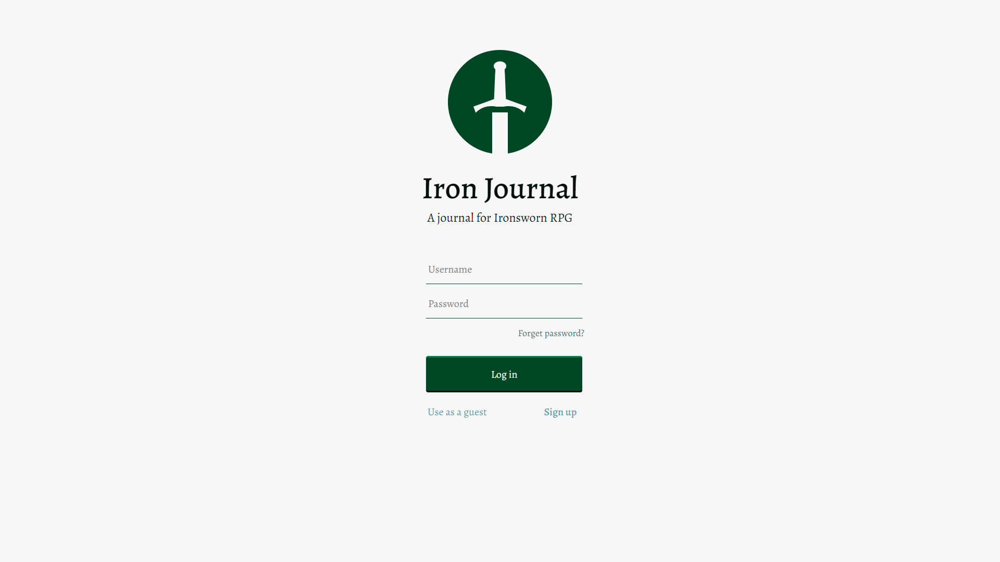
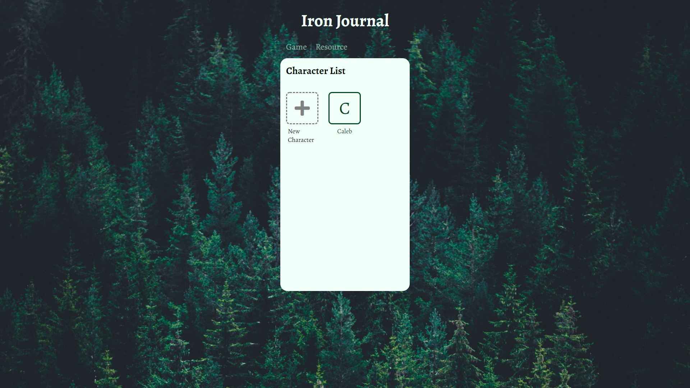

# iron-journal

## Summary
A web assistant for table RPG IronSworn.

## Live Demo
Link: https://iron-journal.yuncyang.com

## Current Feature List
- General
  - Use ReactJs as the main framework.
  - Use React Router for the navigation between different components.
  - Use React Context to store the states that are shared between components.
  - Use Bcrypt to hash the password for sign in/ sign up.
  - Use Nodemailer and JWT for user to reset password when needed.
  - Use Jest for unit testing.
- Account
  - User can create a new account.
  - User can log in using an existing account.
  - User can user the site as a guest without an account.
  - User can request to reset the password. Upon request, an email will be sent to provided email. User can use the temporary address (expire in an hour) to reset the password.
- Character
  - User can view all stored characters.
  - User can add new characters.
  - User can edit detail of existing characters.
  - User can delete existing characters.

## Technologies Used
- ReactJs
- NodeJs
- ExpressJs
- React Router
- Nodemailer
- JWT
- Jest
- PostgreSQL
- Webpack
- Babel
- Sass
- HTML5
- CSS3
- AWS EC2

## Preview



## Planned Features
- Implement asset feature, allowing users to read and edit assets they created.
- Add dice rolling feature.
- Improve styling on the character page.

## Development
### System Requirements
- NodeJs 10 or higher
- NPM 6 or higher
- PostgreSQL 10 or higher

### Getting Started
1. Clone the repository
  ```
  git clone https://github.com/YunCYang/iron-journal
  cd iron-journal
  ```
2. Install all dependencies with NPM
  ```
  npm install
  ```
3. Import the example database to PostrgeSQL
  ```
  npm run db:import
  ```
4. Start the project. You can view the running application by opening http://localhost:3000 in your browser.
  ```
  npm run dev
  ```
